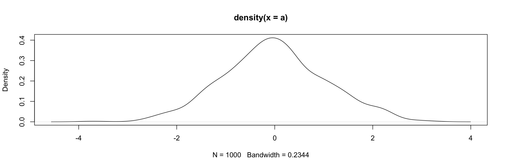

# Oberste Überschrift {#section1}

Wir fügen mal einen normalen Code-Chunk ein. Meines Wissens kann man mit RMarkdown nicht auf Code-Chunks verweisen. Man kann auch Inline-Chunks benutzen. Zum Beispiel ergibt ist das Ergebnis von 3 + 2 = 5.


``` r
a <- rnorm(1000)
```

Man kann allerdings mit Code eine Abbildung erstellen, auf die man dann auch verweisen kann.


``` r
plot(density(a))
```

<div class="figure">

<p class="caption">(\#fig:norm)Dichtefunktion einer normalverteilten Zufallsvariable</p>
</div>

Nun können wir auf Abbildung \@ref(fig:norm) verweisen.

## Zweite Überschrift

Verweise auf die oberste Überschrift:

* siehe [dieser Abschnitt](#section1),
* siehe Abschnitt \@ref(section1).

Man sollte auch ein bisschen Literatur zitieren. Und zwar in Klammern [@lew_effectiveness_2024] aber auch im laufenden Text, das denken bestimmt auch Lew & Wolfer [-@lew_cefr_2024]. Mehrere Zitationen werden übrigens über ; getrennt.

### Dritte Überschrift

Keine wissenschaftliche Veröffentlichung ohne Fußnoten^[Ne wirklich, man braucht immer mindestens eine Fußnote :)].

Eventuell will man auch eine Formel zeigen. Das geht In-Text wie in $y = x^2$ oder abgesetzt:

$$
s = \sqrt{\frac{\sum_i^n{(x_i - \bar{x}})^2}{n}}
$$
Wenn man Formeln allerdings referenzieren will, dann muss man sie (glaube ich) in ein entsprechendes Environment packen.

\begin{equation} 
  f(k) = \binom{n}{k} p^k(1-p)^{n-k}
  (\#eq:binom)
\end{equation} 

Nun kann ich auf Formel \@ref(eq:binom) verweisen.


### Literaturverzeichnis
